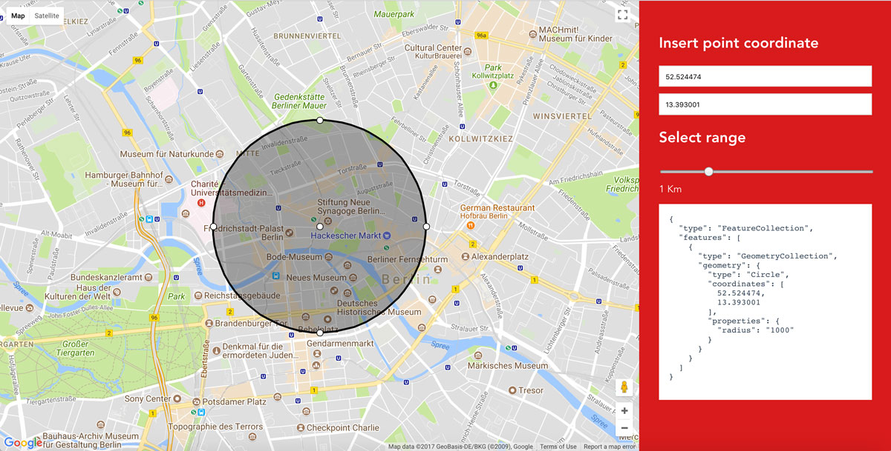

# vue-geolocation-selection

>  GeoJSON handling with string output



## Requirements
    node: 4.0.0

## Build Setup

``` bash
# clone project
git clone https://github.com/cnotv/vue-geolocation-selection.git
cd vue-geolocation-selection

# install dependencies
npm install

# serve with hot reload at localhost:8080
# for a different port prefix with PORT=number_port
npm run dev

# build for production with minification
npm run build
```

This app is created using a [vue-webpack-boilerplate](http://vuejs-templates.github.io/webpack/).
The map is loaded through the component [vue-google-maps](https://github.com/xkjyeah/vue-google-maps).
